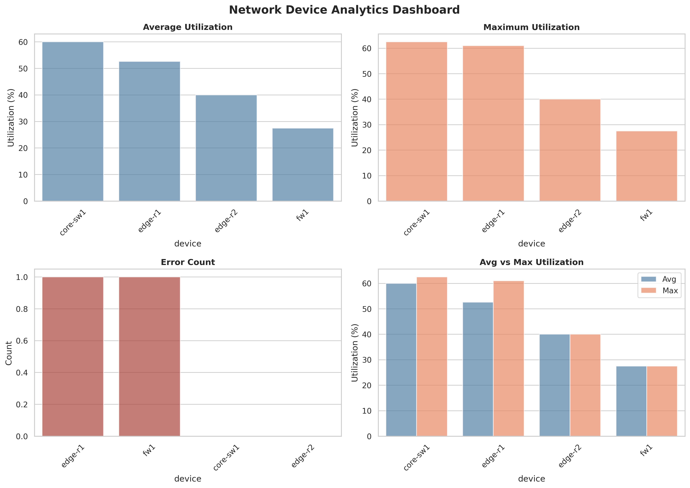

# Network Data Pipeline

A complete ETL/ELT pipeline for network management data demonstrating ingestion, data quality checks, transformation, and analytics.

## Overview

This pipeline processes three data sources:
- **device_inventory.csv**: Device metadata (device, site, vendor, role)
- **interface_stats.csv**: Interface utilization and status metrics
- **syslog.jsonl**: System log events with severity levels

## Requirements
- [uv environment](https://docs.astral.sh/uv/pip/environments/)

## Installation

```bash
uv venv nms-pipeline-tanpham-env --python=3.11
uv pip install -r requirements.txt
```

## Usage

### Basic Usage

Run the complete pipeline:

```bash
bash run.sh
```

## Pipeline Steps

1. **Ingest**: Reads CSV and JSONL files with schema validation
2. **Data Quality Checks**: Validates:
   - Device exists in inventory
   - Timestamps are valid ISO 8601 (UTC)
   - Utilization values are numeric and 0-100
   - Operational status is valid (1 or 2)
3. **Transform**: Joins interface stats with device metadata and matching syslog events (within ±5 minutes)
4. **Analytics**: Generates device-level summary with:
   - Average utilization
   - Maximum utilization
   - Error count (ERROR severity syslogs)

## Output Files

- `outputs/transformed_data.csv`: Clean joined table with all required columns
- `outputs/device_summary.csv`: Device-level analytics summary
- `outputs/invalid_records.csv`: Records that failed DQ checks (if any)

## Architecture

The pipeline is built using Object-Oriented Programming (OOP) principles with separate classes for each ETL stage:

- **`DataIngestion`**: Handles data ingestion from CSV and JSONL sources with schema validation
- **`DataQualityValidator`**: Performs data quality checks and validation rules
- **`DataTransformer`**: Handles data transformation, joins, and enrichment
- **`AnalyticsGenerator`**: Generates analytics and aggregations
- **`NetworkDataPipeline`**: Main orchestrator class that coordinates all stages

## Approach

- **OOP Design**: Clean separation of concerns with dedicated classes for each pipeline stage
- **Schema-driven**: Python dataclasses for type safety and validation
- **Modular & Extensible**: Easy to extend with new validators, transformers, or analytics
- **Error handling**: Invalid records are quarantined with detailed reasons
- **Time-window joins**: Syslog events matched using configurable time windows (default: ±5 minutes)
- **Clean output**: All outputs in CSV format for easy inspection and analysis
- **Method chaining**: Pipeline stages can be called individually or chained together

## Data Structure

### Input Files
- `data/device_inventory.csv`: device, site, vendor, role
- `data/interface_stats.csv`: ts, device, ifName, util_in, util_out, admin_status, oper_status
- `data/syslog.jsonl`: JSON lines with ts, device, severity, message

### Output Schema
**transformed_data.csv**: ts, device, site, vendor, role, ifName, util_in, util_out, oper_status, syslog_severity, syslog_msg

**device_summary.csv**: device, avg_utilization, max_utilization, error_count

## Analytics dashboard

